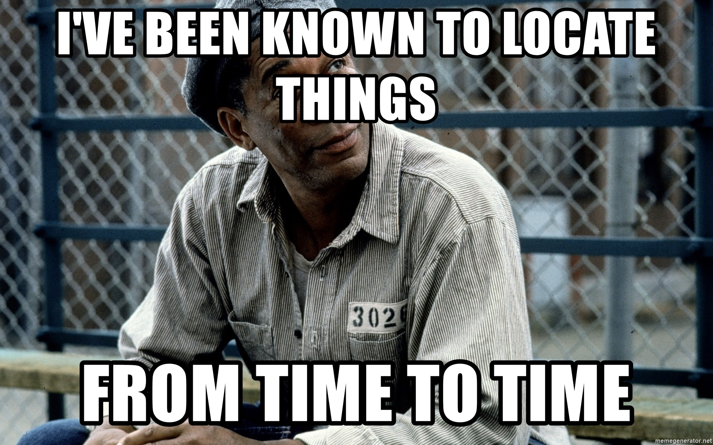

# RedX

Public instance (this fork): https://redx.adamski2003.lol/
Public instance (original): https://redx.cloudns.org/

RedX is a Resonite public folder/item indexer and search engine.

## Run it yourself

(This documentation applies to this fork; the original uses Elasticsearch and the setup steps are different.)

### Requirements

- NodeJS Gallium (16)
- A Meilisearch deployment and an API key with enough access to search, add and delete documents

### Setup

1. Clone this repository, run `npm i` to install dependencies. (Make sure you're running NodeJS 16 before doing this, otherwise the dependency install might fail)
2. Copy `.env.example` to `.env` and fill in the required values.
3. `cd` to the `redx-frontend` directory, run `npm i` to install dependencies and `npm run build` to build the frontend.
4. `cd` back to the root directory and run `npm run server` to start the server. (You won't see any items in the frontend until you run the spider for the first time.)
5. Run the spider with `npm run spider`. This will take a while, but you should see items appearing in the frontend as they're indexed. You can use a cronjob to run this on a schedule.

